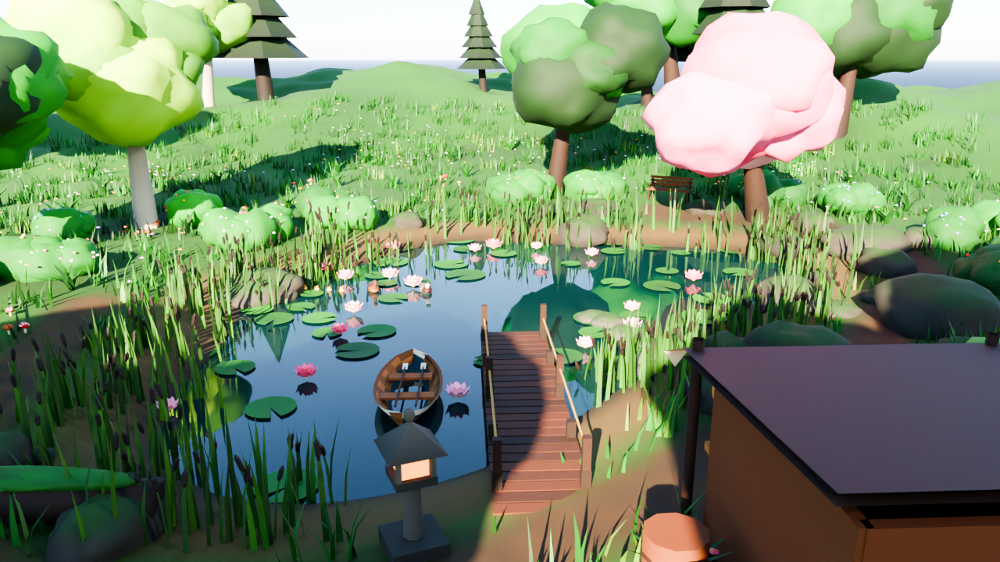

# Still Water 🪷

A peaceful 3D pond — **modelled in Blender**, shown live in the browser.



Open **`index.html`** in any modern browser (single file, works offline).

## What's in it
- **Scene (modelled in Blender):** sculpted terrain and pond, ~28,000 grass blades, reeds, ferns, wildflowers, flowering bushes, lily pads, lotus, mossy rocks, trees, a wooden dock, stone lantern, rowboat, bench, mushrooms, a fallen log and a tackle shop stall
- **Wildlife:** a mallard pair with four ducklings that follow their mother in a line, koi that swim with a real body wave (and sometimes leap), a grey heron wading the shallows, rabbits in the meadow, four species of butterfly that land on flowers, frogs hopping between lily pads, dragonflies and birds. Animals steer around the dock, boat and shore, and react to you: ducks swim off, rabbits bolt, the heron walks away, frogs jump
- **Look:** worn dirt paths, soft baked shadows under trees and props, cloud shadows drifting over the land, wind gusts rolling through the grass, planar water reflections, caustics, ripples, a sky with clouds, stars, a moon and shooting stars, god rays, mist, falling petals, fireflies, bloom and colour grading
- **Automatic day and night** (keys `1`-`4` jump the clock) and **weather** (`R`): rain darkens the light, fills the pond with ripples and brings out stormy fish
- **Sound:** generated wind, water, birds, crickets, rain, frogs and soft chimes (no audio files)

## Maple Hollow (unlocks at level 10)
A second lake, built in Blender 400 m east of the pond: an autumn hollow with a waterfall cascading down a cliff, maples, golden grass, fallen and floating leaves, a pier, and the **Maple Hollow Outfitters** cabin. Travel with the waystone at either lake (walk up and press `E`), the Travel button or `T`.
- **13 new fish** that only bite there, from the Maple Shiner to the Exotic Phoenix Koi
- **5 new rods** sold only at the Outfitters: Maple, Ember Oak, Aurora, Celestial and Leviathan, each with its own finish
- Only the lake you are at is drawn, so the second area costs nothing while you are at the first

## Walking around
You explore in **first person**. Click to capture the mouse and look around (or drag), walk with **WASD** / arrow keys, hold **Shift** to run. On a phone, drag on the left half to walk and on the right half to look.
Day and night pass **automatically** (a full day takes 12 minutes by default; change it in Settings). The clock buttons jump to a time of day and the pause button stops the sun.

## The fishing game
Walk to the water with a modelled rod (cork grip, reel with a turning crank, line guides, a blank that bends when a fish pulls; each rod in the shop has its own finish), look at it, wait for the bobber to dip, hook it, then win the catch bar at the bottom of the screen.
- **Space** or click to cast where you are looking, **Space** at the bite, then **hold** (Space / mouse / touch) to move the white bar right and release to let it fall back. Keep it over the fish to fill the bar
- When a fish bites, a big **!** appears over the bobber, coloured by rarity: red (Common to Rare), purple (Epic), yellow (Legendary), rainbow (Exotic), white and black (Secret). After you hook it the catch bar appears with a 2 second countdown before it comes alive
- **37 species** from Common to Exotic, plus a **Secret** fish that only bites once you have landed 100 fish, each drawn from its own parameters (body shape, tail, fins, pattern). Mutations: Shiny, Albino, Giant
- Time of day and weather change what bites. Catches land in your **bag**
- **Tackle shop** (walk up to the stall and press `E`, or press `B`): sell fish, buy 6 rods, 5 baits, 6 floats and a bigger bag. Gear is level gated
- **Journal** (`J`): every species you have found, stats and mutations. Progress is saved in your browser
- A guided tutorial runs on your first visit (replay with the help button)

## Performance
Quality is **Auto** by default: it lowers resolution, then features, when frames get slow, and climbs back when there is headroom. Pick Low, Medium or High in Settings, or add `?q=low` to the URL.
Rendering is cheaper than a naive build: grass is split into chunks that are culled by distance, shadows update every few frames, reflections render at reduced size, and anti-aliasing is a single FXAA pass.

## How it's made
| file | what |
| --- | --- |
| `build_pond.py` | Blender (`bpy`) script that builds the whole scene, saves `pond.blend`, exports `pond.glb`, renders `preview.png` |
| `pond.blend` | the Blender scene |
| `pond.glb` | exported scene (geometry + vertex colours) |
| `src/fishing.js`, `src/game.js`, `src/ui.js` | the game: casting and the catch bar, data and save, shop / journal / HUD |
| `src/fishart.js`, `src/icons.js` | fish and icons drawn from code (no images, no emoji) |
| `src/creatures.js`, `src/weather.js`, `src/audio.js` | wildlife, rain, generated sound |
| `src/main.js`, `src/template.html` | three.js viewer: water, sky, wind, light, creatures, sound |
| `build.mjs` | bundles the viewer and inlines the gzipped GLB into `index.html` |

Rebuild:
```bash
pip install bpy numpy          # Blender as a Python module (Python 3.11)
python3 build_pond.py          # add --no-render to skip the Cycles preview
npm install && npm run build   # writes index.html
```

Controls: drag to orbit · scroll to zoom · click water for a ripple + note · `H` hides the UI.
Add `?q=low|med|high` to force a quality level.
